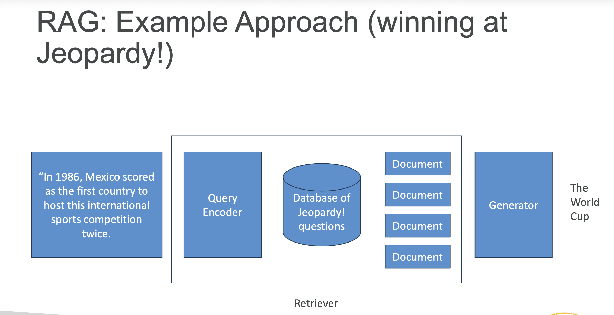
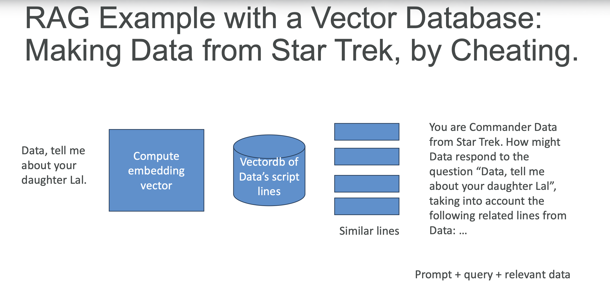

# Section 2: Generative AI Fundamentals and BedRock

## Amazon Bedrock Overview
__Foundation Models__  
* The giant, pre-trained transformer models we are fine tuning for specific tasks, or applying to new applications
* GPT-n (OpenAI)
* Claude (Anthropic)
* DALL-E (OpenAI, Microsoft)
* LLaMa (Meta)
* DeepSeek
* Nova

__AWS Foundation Models (Base Models)__   
* Jurassic-2 (AI21labs)
  - Multilingual LLMs for text generation
  - Spanish, French, German, Portuguese, Italian, Dutch
* Claude (Anthropic)
  - LLM’s for conversations
  - Question answering
  - Workflow automation
* Stable Diffusion (stability.ai)
  - Image, art, logo, design generation
* Llama (Meta)
  - LLM
* Amazon Titan
  - Text summarization
  - Text generation
  - Q&A
  - Embeddings
    * Personalization
    * Search
* Amazon Nova Pro (LLM portfolio of models)
* Amazon Nova Reels
  - Video

__Amazon Bedrock__   
* An API for generative AI Foundation Models
  - Invoke chat, text, or image models
  - Pre-built, your own fine-tuned models, or your own models
  - Third-party models bill you through AWS via their own pricing
  - Support for RAG (Retrieval-Augmented Generation… we’ll get there)
  - Support for LLM agents
* Serverless
* Can integrate with SageMaker

__The Bedrock API Endpoints__  
* __bedrock__: Manage, deploy, train models
* __bedrock-runtime__: Perform inference (execute prompts, generate embeddings) against these models
  - Converse, ConverseStream, InvokeModel, InvokeModelWithResponseStream
* __bedrock-agent__: Manage, deploy, train LLM agents and knowledge bases
* __bedrock-agent-runtime__: Perform inference
against agents and knowledge bases
  - InvokeAgent, Retrieve, RetrieveAndGenerate


__Bedrock IAM permissions__  
* Must use with an IAM user (not root)
* User must have relevant Bedrock permissions
  - `AmazonBedrockFullAccess`
  - `AmazonBedrockReadOnly`

__Amazon Bedrock: Model Access__  
* Amazon is phasing out the need to request access to specific models
* Be sure to check pricing
  - https://aws.amazon.com/bedrock/pricing

__Amazon Converse__  
[Converse Rumtime API](https://docs.aws.amazon.com/bedrock/latest/APIReference/API_runtime_Converse.html)   
[Converse Example](https://docs.aws.amazon.com/bedrock/latest/userguide/conversation-inference.html)    

__More on the Converse API__  
* Unified API for models that support messages
* Specify your prompt in the messages field (or an ARN to prompt management)
* Specify a modelId
* Optionally:
  - Model-specific fields
  - Guardrails
  - Config (max tokens, temperature…)
  - Prompt variables
  - Tools (for agentic AI stuff)

```
POST /model/modelId/converse HTTP/1.1
Content-type: application/json
```

__Fine-tuning__   
* Adapt an existing large language model to your specific use case!
* Additional training using your own data – potentially lots of
it
  - Eliminates need to build up a big conversation to get the results you want (“prompt engineering” / “prompt design”)
  - Saves on tokens in the long run
* Your fine-tuned model can be used like any other
* You can fine-tune a fine-tuned model, making it “smarter”
over time
* Applications:
  - Chatbot with a certain personality or style, or with a certain objective (i.e., customer support, writing ads)
  - Training with data more recent than what the LLM had
  - Training with proprietary data (i.e., your past emails or messages, customer support transcripts)
  - Specific applications (classification, evaluating truth)


__Fine-tuning in Bedrock: “Custom Models”__  
* Titan, Cohere, and Meta models may be "fine-tuned"
* Text models: provide labeled training pairs of prompts and completions
  - Can be questions and answers
  - Upload training data into S3
* Image models: provide pairs of image S3 paths to image descriptions (prompts)
  - Used fo text-to-image or image-to-embedding models  
* Use a VPC and PrivateLink for sensitive training data
* This can get expensive
* Your resulting "custom model" may then be used like any other.

```json
{"prompt": "What is the meaning of life?", "completion": "The meaning of life is 42."}
{"prompt": "Who was the best Dr. Who?", "completion": "Matt Smith in series 5 was the best and anyone who says otherwise is wrong."}
{"prompt": "Is Dr. Who better than Star Trek?", "completion": "Blasphemer! Star Trek changed the world like no other science fiction has."}
```

__“Continued Pre-Training”__  
* Like fine-tuning, but with unlabeled data
* Just feed it text to familiarize the model with
  - Your own business documents
  - Whatever
* Basically including extra data into the model itself
  - So you don’t need to include it in the prompts

```json
{"input": "Spring has sprung. "}
{"input": "The grasshas riz."}
{"input": "I wonder where the flowers is."}
```

__Low-Rank Adaptation (LoRA)__  
* We don’t update the entire model, just slap on some “low-rank matrices” to the attention weights (usually), and train those.
  - “Low-rank” refers to the complexity of the underlying matrices in the model, but you don't need that level of understanding for this exam
* At inference, these fine-tuned weights get added into the base model
* Base model remains unchanged
* Very efficient for storage, training and inference
* This is different from an "adaptor layer" added to the top of a model

__Retrieval Augmented Generation (RAG)__  
* Like an open-book exam for LLMs
* You query some external database for the answers instead of relying on the LLM
* Then, work those answers into the prompt for the LLM to work with
  - Or, use tools and functions to incorporate the search into the LLM in a slightly more principled way



__RAG: Pros__  
* Faster & cheaper way to incorporate new or proprietary information into “GenAI” vs. fine-tuning
* Updating info is just a matter of updating a database
* Can leverage “semantic search” via vector stores
* Can prevent “hallucinations” when you ask the model about something it wasn’t trained on
* If your boss wants “AI search”, this is an easy way to deliver it.
* Technically you aren’t “training” a model with this data

__RAG: Cons__  
* You have made the world’s most overcomplicated search engine
* Very sensitive to the prompt templates you use to incorporate your data
* Non-deterministic
* It can still hallucinate
* Very sensitive to the relevancy of the information you retrieve

__Choosing a Database (Knowledge Base Data Store) for RAG__  
* You could just use whatever database is appropriate for the type of data you are retrieving
  - Graph database (i.e., Neo4j) for retrieving product recommendations or relationships between items
  - Opensearch or something for traditional text search (TF/IDF)
  - But almost every example you find of RAG uses a Vector database
  - Note Elasticsearch / Opensearch can function as a vector DB


__Embeddings__  
* An embedding is just a big vector associated with your data
* Think of it as a point in multi-dimensional space (typically 100s or thousands of dimensions)
* Embeddings are computed such that items that are similar to each other are close to each other in that space
* We can use embedding base models (like Titan) to compute them en masse
* Embeddings are vectors, so store them in a vector database!
* It just stores your data alongside their computed embedding vectors
* Leverages the embeddings you might already have for ML
* Retrieval looks like this:
  - Compute an embedding vector for the thing you want to search for
  - Query the vector database for the top items close to that vector
  - You get back the top-N most similar things (K-Nearest Neighbor)
  - “Vector search”
* Examples of vector databases
  - Coercing existing databases to do vector search
    * Opensearch / Elasticsearch, SQL, Neptune, Redis, MongoDB, Cassandra
  - Purpose-built vector DB’s
    * Pinecone, Weaviate (commercial)
    * Chroma, Marqo, Vespa, Qdrant, LanceDB, Milvus, vectordb (open source)


